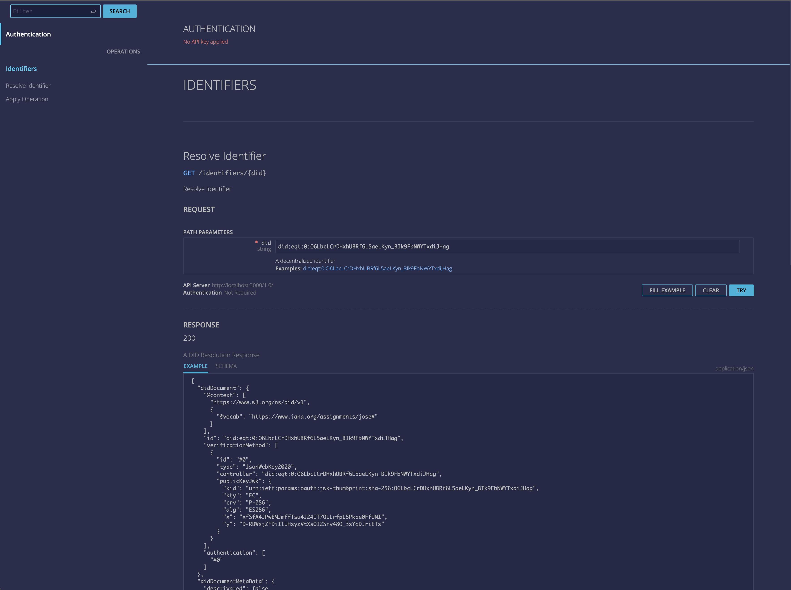

# DID EQT


#### [Questions? Contact Transmute](https://transmute.typeform.com/to/RshfIw?typeform-source=did-eqt)

#### 🚧 Warning Experimental 🔥

This is a project repository for exploring SCITT Architecture Components.

This is NOT a reference / sample implementation for SCITT Architecture.

## Contributing

See the latest data tracker for [SCITT Archiecture](https://datatracker.ietf.org/doc/draft-birkholz-scitt-architecture/).

See the mailing list regarding [IETF SCITT work](https://www.ietf.org/mailman/listinfo/scitt).

If you are excited to implement a component of this proposed architecture with a different technology choice, such as with a different transparecy registry component (similar Amazon QLDB) feel free to fork and experiment.

If you are interested in a different policy language (similar to Open Policy Agent / Rego), feel free to fork and experiment.

This project may be moved to another github organization in the future.

#### Adding an Open Policy Agent Rego Policy

- [See also the DIDs and OPA Primer](./docs/did-eqt-opa-primer.md)

Generate a key to control the policy:

```
npm run did-eqt generate-key ES256 --silent > ./docs/cli-examples/key4.json
```

Create and publish a DID.

This uses a local cli connection to Amazon QLDB to publish directly, without using the REST API.

The DID is used to hold the policy and all updates to it from this point on:

```
npm run did-eqt create ./docs/cli-examples/key4.json --silent -- --publish \
> ./docs/cli-examples/rego-policy-did-create-response.json
DID=$(cat ./docs/cli-examples/rego-policy-did-create-response.json | jq '.data.didDocument.id' -r )
```

#### Prepare a DID update operation, including a rego policy:

```
cat ./docs/cli-examples/rego-policy-did-create-response.json \
| jq --rawfile policy ./docs/opa-policy-examples/verify-epcis-cold-chain.rego '.data.didDocument + {policy: $policy}' \
| > ./docs/cli-examples/api-rego-add-operation.json

npm run did-eqt update $DID ./docs/cli-examples/api-rego-add-operation.json ./docs/cli-examples/key4.json --silent \
> ./docs/cli-examples/api-rego-add-operation-jws.json

```

#### Review the DID update operation (JSON Web Signature):

```
jq '.jws' ./docs/cli-examples/api-rego-add-operation-jws.json \
| jq -r 'split(".") | .[0],.[1] | @base64d | fromjson'
```

```json
{
  "iss": "did:eqt:0:tz9SRFwW-zq5hnJuPxLrhgk2zNbou0bFT2FCESYFvLc",
  "kid": "#0",
  "cty": "vnd.aws.qldb.did.update",
  "alg": "ES256"
}
{
  "@context": [
    "https://www.w3.org/ns/did/v1",
    {
      "@vocab": "https://www.iana.org/assignments/jose#"
    }
  ],
  "verificationMethod": [
    {
      "id": "#0",
      "type": "JsonWebKey2020",
      "publicKeyJwk": {
        "kid": "urn:ietf:params:oauth:jwk-thumbprint:sha-256:tz9SRFwW-zq5hnJuPxLrhgk2zNbou0bFT2FCESYFvLc",
        "kty": "EC",
        "crv": "P-256",
        "alg": "ES256",
        "x": "paXc8AVS7ql2XiKj_bc2lSWdFek52EnFtt_6yjkGGSI",
        "y": "QYtPG2WxTxo1YxMRgC1q-kyYp45UHWklNabhF4QIu6c"
      }
    }
  ],
  "authentication": [
    "#0"
  ],
  "assertionMethod": [
    "#0"
  ],
  "capabilityInvocation": [
    "#0"
  ],
  "capabilityDelegation": [
    "#0"
  ],
  "policy": "package verify_epcis_cold_chain\n\nimport future.keywords.in\n\ndefault endorse = false\n\ndefault force_validation_error = false\n\nissuer_is_authorized {\n    input.credential.issuer.id in input.authorized_cold_chain_inspectors\n}\n\ncredential_type_is_acceptable {\n    \"EPCISDocumentCredential\" in input.credential.type\n}\n\n\ncredential_claims_are_active {\n    time.parse_rfc3339_ns(input.credential.issuanceDate) <= time.now_ns()\n}\n\n\ntemperature_claim_provided {\n    \"Temperature\" == input.credential.credentialSubject.eventList[0].sensorElementList[0].sensorReport[0].type\n}\n\n\ntemperature_claim_is_in_the_past {\n    endTime := input.credential.credentialSubject.eventList[0].sensorElementList[0].sensorMetadata.endTime\n    time.parse_rfc3339_ns(endTime) <= time.now_ns()\n}\n\nendorse {\n    issuer_is_authorized\n    credential_type_is_acceptable\n    credential_claims_are_active\n    temperature_claim_provided\n    temperature_claim_is_in_the_past\n    not force_validation_error\n}"
}
```

Start the web server (in case its not running):

```
npm run server:start
```

#### Submit the DID update operation to REST API to update the policy

```
curl -sX POST -H "Content-Type: application/json" -d @./docs/cli-examples/api-rego-add-operation-jws.json http://localhost:3000/1.0/method/operations | jq
```

Example response:

```json
{
  "status": 200,
  "message": "An entry has been updated in the registry",
  "data": {
    "didDocument": {
      "@context": [
        "https://www.w3.org/ns/did/v1",
        {
          "@vocab": "https://www.iana.org/assignments/jose#"
        }
      ],
      "id": "did:eqt:0:tz9SRFwW-zq5hnJuPxLrhgk2zNbou0bFT2FCESYFvLc",
      "verificationMethod": [
        {
          "id": "#0",
          "type": "JsonWebKey2020",
          "controller": "did:eqt:0:tz9SRFwW-zq5hnJuPxLrhgk2zNbou0bFT2FCESYFvLc",
          "publicKeyJwk": {
            "kid": "urn:ietf:params:oauth:jwk-thumbprint:sha-256:tz9SRFwW-zq5hnJuPxLrhgk2zNbou0bFT2FCESYFvLc",
            "kty": "EC",
            "crv": "P-256",
            "alg": "ES256",
            "x": "paXc8AVS7ql2XiKj_bc2lSWdFek52EnFtt_6yjkGGSI",
            "y": "QYtPG2WxTxo1YxMRgC1q-kyYp45UHWklNabhF4QIu6c"
          }
        }
      ],
      "authentication": ["#0"],
      "assertionMethod": ["#0"],
      "capabilityInvocation": ["#0"],
      "capabilityDelegation": ["#0"],
      "policy": "package verify_epcis_cold_chain\n\nimport future.keywords.in\n\ndefault endorse = false\n\ndefault force_validation_error = false\n\nissuer_is_authorized {\n    input.credential.issuer.id in input.authorized_cold_chain_inspectors\n}\n\ncredential_type_is_acceptable {\n    \"EPCISDocumentCredential\" in input.credential.type\n}\n\n\ncredential_claims_are_active {\n    time.parse_rfc3339_ns(input.credential.issuanceDate) <= time.now_ns()\n}\n\n\ntemperature_claim_provided {\n    \"Temperature\" == input.credential.credentialSubject.eventList[0].sensorElementList[0].sensorReport[0].type\n}\n\n\ntemperature_claim_is_in_the_past {\n    endTime := input.credential.credentialSubject.eventList[0].sensorElementList[0].sensorMetadata.endTime\n    time.parse_rfc3339_ns(endTime) <= time.now_ns()\n}\n\nendorse {\n    issuer_is_authorized\n    credential_type_is_acceptable\n    credential_claims_are_active\n    temperature_claim_provided\n    temperature_claim_is_in_the_past\n    not force_validation_error\n}"
    },
    "didDocumentMetaData": {
      "documentId": "GZKrRmWvLrq4PM5icALGdY",
      "deactivated": false
    },
    "didResolutionMetadata": {
      "processingTimeMilliseconds": 13,
      "ioUsage": {
        "readIOs": 3
      }
    }
  }
}
```

#### Resolve the (policy) identifier to obtain the rego policy:

```
curl -sX GET "http://localhost:3000/1.0/identifiers/$DID" | jq '.didDocument.policy' -r
```

See the policy details below:

```rego
package verify_epcis_cold_chain

import future.keywords.in

default endorse = false

default force_validation_error = false

issuer_is_authorized {
input.credential.issuer.id in input.authorized_cold_chain_inspectors
}

credential_type_is_acceptable {
"EPCISDocumentCredential" in input.credential.type
}

credential_claims_are_active {
time.parse_rfc3339_ns(input.credential.issuanceDate) <= time.now_ns()
}

temperature_claim_provided {
"Temperature" == input.credential.credentialSubject.eventList[0].sensorElementList[0].sensorReport[0].type
}

temperature_claim_is_in_the_past {
endTime := input.credential.credentialSubject.eventList[0].sensorElementList[0].sensorMetadata.endTime
time.parse_rfc3339_ns(endTime) <= time.now_ns()
}

endorse {
issuer_is_authorized
credential_type_is_acceptable
credential_claims_are_active
temperature_claim_provided
temperature_claim_is_in_the_past
not force_validation_error
}
```

Have obtained the policy from a the trusted transparency service, it can now be used to evaluate a claim, for example:

Given this claim regarding a temperature sensor in a cold chain for seafood scenario:

```json
{
  "authorized_cold_chain_inspectors": ["did:example:123"],
  "credential": {
    "@context": ["https://www.w3.org/ns/credentials/v2"],
    "id": "urn:uuid:987",
    "type": ["VerifiableCredential", "EPCISDocumentCredential"],
    "issuer": {
      "id": "did:example:123",
      "type": ["Device", "ColdChainInspector"]
    },
    "issuanceDate": "2010-01-01T19:23:24Z",
    "credentialSubject": {
      "id": "did:example:456",
      "type": ["EPCISDocument"],
      "eventList": [
        {
          "type": "ObjectEvent",
          "action": "OBSERVE",
          "bizStep": "inspecting",
          "epcList": ["urn:epc:id:sgtin:4012345.011111.9876"],
          "eventTime": "2019-04-02T15:00:00.000+01:00",
          "eventTimeZoneOffset": "+01:00",
          "readPoint": {
            "id": "urn:epc:id:sgln:4012345.00005.0"
          },
          "sensorElementList": [
            {
              "sensorMetadata": {
                "startTime": "2019-04-01T15:00:00.000+01:00",
                "endTime": "2019-04-02T14:59:59.999+01:00"
              },
              "sensorReport": [
                {
                  "type": "Temperature",
                  "minValue": 12.4,
                  "maxValue": 13.8,
                  "uom": "CEL"
                }
              ]
            }
          ]
        }
      ]
    }
  }
}
```

Evaluate the input json against the policy from the registry:

```
./opa eval --format pretty data \
-i ./docs/opa-policy-examples/verify-epcis-cold-chain.input.json \
-d ./docs/opa-policy-examples/verify-epcis-cold-chain.rego
```

Example response:

```
{
  "verify_epcis_cold_chain": {
    "credential_claims_are_active": true,
    "credential_type_is_acceptable": true,
    "endorse": true,
    "force_validation_error": false,
    "issuer_is_authorized": true,
    "temperature_claim_is_in_the_past": true,
    "temperature_claim_provided": true
  }
}
```

## Development

### CLI

There is a package json script alias for the binary, note the `npm run` prefix below.

CLI expects a .env to be available similar to (example.env)[./example.env].

🔥 This is very experimental stuff, be carefult with your env / secrets. 🔥

#### Key Generation

```
npm run did-eqt generate-key ES256 --silent > ./docs/cli-examples/key.json
npm run did-eqt generate-key ES256 --silent > ./docs/cli-examples/key1.json
npm run did-eqt generate-key ECDH-ES+A256KW --silent > ./docs/cli-examples/key2.json
```

```
npm run did-eqt generate-for authenticity --silent > ./docs/cli-examples/key.authenticity.json
npm run did-eqt generate-for privacy --silent > ./docs/cli-examples/key.privacy.json
```

#### DID Resolution

```
npm run did-eqt resolve did:eqt:0:WPmv5E9KzVImXCpmI0W0Vm_znBKXpHTuIzYwxq4r4N0 --silent > ./docs/cli-examples/resolution.json
```

##### DID Dereferencing

```
npm run did-eqt dereference did:eqt:0:JE48WunoqLPQoEtddJSU7LyYMbDokokWavIDNMllk88#0 --silent > ./docs/cli-examples/dereference.json
npm run did-eqt dereference did:eqt:0:JE48WunoqLPQoEtddJSU7LyYMbDokokWavIDNMllk88#0 --silent
```

### Method Operations

#### Create Operation

```
npm run did-eqt create ./docs/cli-examples/key.json --silent > ./docs/cli-examples/did-method-create-operation.json
npm run did-eqt create ./docs/cli-examples/key.json --silent -- --publish
npm run did-eqt create ./docs/cli-examples/key1.json --silent -- --publish
```

#### Update Operation

```
npm run did-eqt update did:eqt:0:51kEbpvjD8Ygm0vSsm7WcrcsIU7DrDImQboAcnyiZ7Q ./docs/cli-examples/doc.json ./docs/cli-examples/key.json --silent > ./docs/cli-examples/did-method-update-operation.json
npm run did-eqt update did:eqt:0:51kEbpvjD8Ygm0vSsm7WcrcsIU7DrDImQboAcnyiZ7Q ./docs/cli-examples/doc.json ./docs/cli-examples/key.json --silent -- --publish
npm run did-eqt update did:eqt:0:bd6mdWq8VLetwbVJpRPGUyiyeAQS0T_esB7rcNVkELA ./docs/cli-examples/doc2.json ./docs/cli-examples/key1.json --silent -- --publish
```

#### Deactivate Operation

```
npm run did-eqt deactivate did:eqt:0:51kEbpvjD8Ygm0vSsm7WcrcsIU7DrDImQboAcnyiZ7Q ./docs/cli-examples/key.json --silent > ./docs/cli-examples/did-method-deactivate-operation.json
npm run did-eqt deactivate did:eqt:0:51kEbpvjD8Ygm0vSsm7WcrcsIU7DrDImQboAcnyiZ7Q ./docs/cli-examples/key.json --silent -- --publish
```

### Capabilities

#### Sign Data

```
npm run did-eqt sign ./docs/cli-examples/key.json did:eqt:0:-JHL9Tbsc5BpkeR6amgD10gTNU7n7z2075-zSITUNvQ #0 ./docs/cli-examples/message.json --silent > ./docs/cli-examples/message.signed.json
npm run did-eqt sign ./docs/cli-examples/key.json did:eqt:0:-JHL9Tbsc5BpkeR6amgD10gTNU7n7z2075-zSITUNvQ #0 ./docs/cli-examples/message.json --silent
```

#### Verify Signature Data

```
npm run did-eqt verify ./docs/cli-examples/message.signed.json --silent -- --decode > ./docs/cli-examples/message.verified.json
npm run did-eqt verify ./docs/cli-examples/message.signed.json --silent -- --decode
```

#### Encrypt

```
npm run did-eqt encrypt did:eqt:0:bd6mdWq8VLetwbVJpRPGUyiyeAQS0T_esB7rcNVkELA ./docs/cli-examples/message.json --silent > ./docs/cli-examples/message.encrypted.json
```

#### Decrypt

```
npm run did-eqt decrypt ./docs/cli-examples/key2.json ./docs/cli-examples/message.encrypted.json --silent -- --decode
```

### API

There is an Open API v3 defintion for the REST API.



```
npm run did-eqt generate-key ES256 --silent > ./docs/cli-examples/key3.json
npm run did-eqt create ./docs/cli-examples/key3.json --silent -- --publish
npm run did-eqt update did:eqt:0:O6LbcLCrDHxhUBRf6L5aeLKyn_BIk9FbNWYTxdiJHag ./docs/cli-examples/doc3.json ./docs/cli-examples/key3.json --silent > ./docs/cli-examples/api-update-operation.json
npm run server:start
curl -sX POST -H "Content-Type: application/json" -d @./docs/cli-examples/api-update-operation.json http://localhost:3000/1.0/method/operations | jq
```
